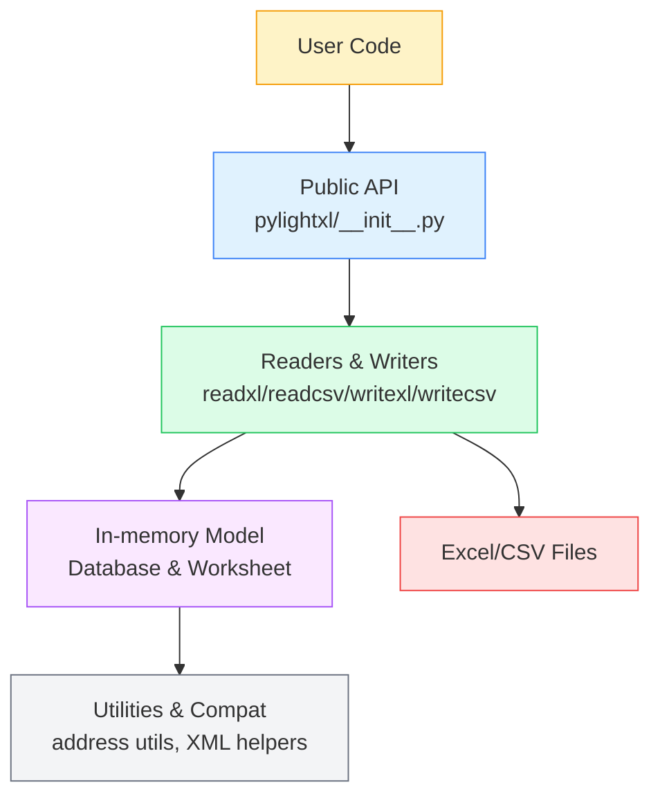

## pylightxl Codebase Overview 🧠📊

This document provides a **developer-focused overview** of the `pylightxl` codebase: its purpose, high-level architecture, noteworthy design decisions, likely pain points, and realistic directions for future enhancements. It is intended as a **quick onboarding map** for new contributors and a **reference** for maintainers planning larger changes.

---

## Purpose and Scope 🎯

`pylightxl` is a **lightweight, zero-dependency Excel reader/writer** for Python 2.7.18–3+. Its primary goals are:

- **Read** modern Excel workbooks (`.xlsx`, `.xlsm`) and CSV files using only the Python standard library.
- **Expose** a simple, intuitive in-memory model (`Database` / `Worksheet`) for accessing worksheet data, formulas, comments, and named ranges.
- **Write** both new and existing Excel workbooks, plus CSV exports, without requiring Excel or heavyweight dependencies like `pandas`/`openpyxl`.
- **Remain portable and embeddable** as a single source file that can be copied directly into downstream projects that have strict dependency or packaging constraints.

**Quick summary table**

| Aspect            | Description                                                                                  |
| -----------------| -------------------------------------------------------------------------------------------- |
| 🎯 Primary goal  | Light, reliable Excel/CSV reader & writer with **zero non-stdlib dependencies**            |
| 🧱 Core model    | `Database` (workbook) + `Worksheet` (sheet) abstraction                                     |
| 📥 Input formats | `.xlsx`, `.xlsm`, `.csv`                                                                     |
| 📤 Output formats| `.xlsx` (new or in-place update), `.csv`                                                    |
| 🚫 Non-goals     | Rich formatting, charts, images, macros – focus is strictly on **cell data**               |

The public API is intentionally small and centers on:

- **Readers**: `readxl`, `readcsv`
- **Writers**: `writexl`, `writecsv`
- **Data model**: `Database`, `Worksheet`

---

## High-Level Architecture 🧩

At a high level, `pylightxl` is organized as:

- A **single main implementation module**: `pylightxl/pylightxl.py`
- A **thin package façade**: `pylightxl/__init__.py`
- **Tests** under `test/` that exercise reading, writing, and the data model
- **Documentation** under `doc/source/` (Sphinx) that mirrors the core concepts

Conceptually, the library can be thought of as three main layers:

1. **I/O layer (Readers & Writers)**
2. **In-memory model (`Database` / `Worksheet`)**
3. **Utility & compatibility layer**

These are logically separated in `pylightxl.py` using section headers (SEC‑00..SEC‑06), but all live in the same file for distribution reasons.

**Architecture at a glance**



**Key components table**

| Layer / Component     | Location                    | Responsibility                                                  |
| --------------------- | -------------------------- | ---------------------------------------------------------------- |
| 🧩 Public API         | `pylightxl/__init__.py`    | Re-export primary functions/classes for end users               |
| 📥 Readers            | `pylightxl.py` (SEC-03)    | Parse Excel/CSV into a `Database`                               |
| 📤 Writers            | `pylightxl.py` (SEC-04)    | Persist a `Database` to XLSX/CSV                                |
| 🧱 Data model         | `pylightxl.py` (SEC-05)    | Represent workbooks and worksheets in memory                    |
| 🛠 Utilities & compat | `pylightxl.py` (SEC-02/06) | Address conversion, XML helpers, Python 2/3 shims               |
| ✅ Tests              | `test/`                    | Verify read/write behavior and XML generation                   |
| 📚 Docs               | `doc/source/`              | User and API documentation (Sphinx-based)                       |

### 1. Public Package Surface

`pylightxl/__init__.py` re-exports the key API symbols from the main module:

- `readxl`, `readcsv`
- `writexl`, `writecsv`
- `Database`

Typical user code imports from here:

```python
from pylightxl import readxl, writexl
```

### 2. In-Memory Model: `Database` and `Worksheet` 🧱

The in-memory representation of a workbook is built around two classes:

- **`Database`**
  - Holds:
    - A mapping of worksheet names to `Worksheet` instances.
    - The display order of worksheets.
    - A shared string table (for Excel’s sharedStrings optimization).
    - Named ranges metadata.
  - Provides:
    - `ws(name)`: access to a `Worksheet` by name.
    - `ws_names`: ordered list of sheet names.
    - Worksheet management (`add_ws`, `remove_ws`, `rename_ws`).
    - Global empty-cell default via `set_emptycell`.
    - Named range API (`add_nr`, `remove_nr`, `nr_names`, `nr`, `nr_loc`, `update_nr`).

- **`Worksheet`**
  - Internally stores cell data in a dict keyed by address (e.g. `'A1'`) with payload:
    - `v`: value (`int`, `float`, `bool`, `str`, or empty).
    - `f`: formula (without leading `=` in storage).
    - `s`: style (currently not heavily used in public API).
    - `c`: comment text.
  - Caches `maxrow` and `maxcol` at construction time for sizing.
  - Read operations:
    - `index(row, col, output='v')`
    - `address(address, output='v')`
    - `range(address_or_row_or_col, output='v')` (supports rectangular ranges, whole rows `1:3`, whole columns `A:C`).
    - Convenience accessors: `row`, `col`, `rows`, `cols`.
    - Semi-structured helpers:
      - `keyrow` / `keycol` for header/key lookups.
      - `ssd` for semi-structured dataset extraction by header markers.
  - Write/update operations:
    - `update_index`, `update_address`, `update_range` for setting values or formulas.

This model gives users a spreadsheet-like abstraction while remaining simple and Pythonic.

### 3. Read Path: `readxl` and `readcsv` 📥

#### `readxl`

`readxl` is responsible for consuming `.xlsx`/`.xlsm` files and producing a populated `Database`. Internally it:

- Normalizes input (string path, `pathlib.Path`, Django file object, file-like handle) via `readxl_check_excelfile`.
- Opens the workbook as a ZIP archive (`zipfile.ZipFile`).
- Parses workbook-level XML:
  - `xl/workbook.xml` (sheet list, defined names).
  - `xl/_rels/workbook.xml.rels` (relationships to sheets, styles, shared strings, comments, etc.).
- Loads shared resources:
  - Shared string table from `xl/sharedStrings.xml` (if present).
  - Styles and number formats from `xl/styles.xml` to interpret dates/times.
  - Worksheet-specific relationships and comments.
- For each sheet:
  - Reads the corresponding `xl/worksheets/sheet#.xml`.
  - Walks cell nodes (`<c>` elements), interprets:
    - Data type from the `t` attribute (shared string, bool, inline string, etc.).
    - Number formatting from the style index to detect dates/times.
  - Converts raw strings to `int`/`float`/`bool`/`str` as appropriate.
  - Attaches formulas and comments.
  - Populates the corresponding `Worksheet` in the `Database`.
- Builds named ranges from `<definedNames>` and attaches them to the `Database`.

This entire flow is implemented using only `zipfile` and `xml.etree` from the standard library.

#### `readcsv`

`readcsv` provides a parallel flow for CSV input:

- Accepts filenames, `pathlib.Path`, or in-memory `io.StringIO`.
- Reads rows via the `csv` module and builds a single-sheet `Database`.
- Performs basic type coercion (tries `int`, then `float`, plus boolean recognition) before falling back to strings.

### 4. Write Path: `writexl` and `writecsv` 📤

#### `writexl`

`writexl` writes a `Database` back to disk as a `.xlsx` file by choosing one of two strategies:

- **New workbook writer (`writexl_new_writer`)**
  - Builds a minimal but valid Excel workbook ZIP from scratch:
    - Core relationships (`_rels/.rels`).
    - Document properties (`docProps/app.xml`, `docProps/core.xml`).
    - Workbook metadata (`xl/workbook.xml`).
    - One `xl/worksheets/sheet#.xml` per `Worksheet`.
    - Shared strings (`xl/sharedStrings.xml`) if needed.
    - Workbook relationships (`xl/_rels/workbook.xml.rels`).
    - Content types (`[Content_Types].xml`).
  - Uses helper functions to generate each XML part as a string.

- **Alternate writer / in-place update (`writexl_alt_writer`)**
  - Starts from an existing workbook:
    - Extracts the workbook ZIP to a temp directory.
    - Rewrites specific XML parts (e.g., `docProps/app.xml`, sheet XMLs).
    - Maintains or reconstructs relationships via helpers like `writexl_alt_getsheetref`.
    - Regenerates shared strings and workbook relationships.
    - Carefully removes unsupported artifacts (drawings, printer settings, macros, custom properties, etc.) that might cause Excel to request "repairs".
  - Handles Windows-specific filesystem quirks and lock scenarios with multiple fallbacks.

Both writers rely on the `Database`/`Worksheet` model to iterate over cells and determine which shared strings and size metadata to emit.

#### `writecsv`

`writecsv` exports worksheets to CSV:

- Either:
  - Writes one file per worksheet (`<base>_<sheetname>.csv`), or
  - Writes to a provided `StringIO` handle.
- Iterates over rows/columns up to the sheet’s `size` and stringifies values.
- Handles path normalization and common filesystem errors (e.g., locked files).

### 5. Utilities and Compatibility Layer 🛠

The bottom of `pylightxl.py` contains a set of reusable helpers:

- **Address/index converters**
  - `utility_address2index`, `utility_index2address`
  - `utility_columnletter2num`, `utility_num2columnletters`
- **XML namespace helpers**
  - `utility_xml_namespace` to consistently extract element namespaces.
- **Python 2/3 compatibility**
  - Custom aliases for `FileNotFoundError`, `PermissionError`, `WindowsError` where missing.
  - `unicode` aliasing and conditional imports for `typing`.
  - Docstring-style type hints (`# type: ...`) to keep Python 2 compatibility.

These utilities are heavily reused across both the read and write paths.

### 6. Tests and Documentation ✅

- **Tests (`test/`)**
  - `test_readxl.py` exercises:
    - File validation and error messages.
    - Excel/CSV reading across various formats and edge cases.
    - Behavior of `Database`/`Worksheet` APIs (rows/cols, ranges, named ranges, `ssd`, empty-cell handling, utilities).
  - `test_writexl.py` verifies:
    - Correct XML emission for all writer helper functions.
    - In-place writer behavior when modifying existing workbooks.
    - CSV writing for both file and in-memory targets.

- **Docs (`doc/source/`)**
  - Sphinx-based documentation mirroring the conceptual organization:
    - Feature overview and limitations.
    - Installation and quickstart.
    - Detailed pages on `readxl`, `writexl`, and the `Database` model.
    - Revision history, license, and code of conduct.

---

## Design Trade-offs and Pain Points ⚖️

From a maintainer’s perspective, several trade-offs and likely pain points stand out:

| Area                         | Pain Point ⚠️                                                                 | Impact 📉                                           | Notes 💬                                         |
| ---------------------------- | ----------------------------------------------------------------------------- | --------------------------------------------------- | ----------------------------------------------- |
| Monolithic main module       | All core logic lives in `pylightxl.py`                                       | Harder navigation and refactoring                   | Done intentionally to keep a single-file distro |
| XML I/O ↔ data model coupling| Readers/writers directly touch `Database` internals and shared state         | Limits extensibility and streaming options          | Refactoring requires careful API preservation   |
| Legacy Python 2 support      | Conditionals/shims sprinkled across code                                     | Extra complexity around I/O, encoding, and typing   | Valuable for compatibility, costly for clarity  |
| Writer filesystem behavior   | Complex Windows-specific paths and fallbacks in `writexl_alt_writer`         | Harder to reason about, potential edge-case bugs    | Well-tested but intricate                       |
| Partial type hinting         | Comment-based hints only; no `py.typed`                                      | Weaker static analysis and IDE support              | Good base to evolve to full typing              |

---

## Potential Enhancements and Future Directions 🚀

The following improvements are realistic and align with the current design:

**Enhancement roadmap (high-level)**

| Priority ⭐ | Idea                            | Area           | Quick Win? ⚡ | Notes |
| ---------- | ------------------------------- | -------------- | ------------ | ----- |
| ⭐⭐⭐       | Improve error/deprecation handling | Core API      | Yes          | Swap `print` for `warnings` + custom exceptions |
| ⭐⭐⭐       | Modern typing support           | Developer UX   | Medium       | Adds `py.typed`, proper annotations             |
| ⭐⭐        | Internal modularization         | Architecture   | Medium       | Can be done behind a build step                 |
| ⭐⭐        | Streaming/large-file APIs       | Performance    | No           | Requires careful design around current model    |
| ⭐         | CLI wrapper                     | UX/Tooling     | Yes          | Thin layer over existing APIs                   |
| ⭐         | Better CSV configurability      | I/O            | Yes          | Extend current options without breaking API     |

- **Internal modularization (behind the same public API)**
  - Refactor `pylightxl.py` internally into conceptual modules:
    - `io_read`, `io_write`, `model`, `utils`, `compat`
  - Either:
    - Use a build step to produce the single-file distribution, or
    - Keep multi-file layout for development while publishing a consolidated artifact.
  - Benefit: clearer boundaries, easier navigation, and more focused testing.

- **Improved error and deprecation handling**
  - Replace `print`-based deprecation messages and some generic exceptions with:
    - `warnings.warn` (with custom warning types).
    - A central `PylightXLError` exception hierarchy for programmatic error handling.
  - Benefit: better integration into larger systems and cleaner logs.

- **Modern typing support**
  - Add full function annotations where possible and ship a `py.typed` marker.
  - Consider an officially documented “Python 3+ only” configuration or branch with:
    - Native type hints.
    - Cleaner string/bytes behavior.
  - Benefit: improved IDE support, refactor safety, and user confidence.

- **Streaming / large-file APIs**
  - Introduce optional APIs for:
    - Row-wise streaming reads using `iterparse` on worksheet XML.
    - Chunked processing interfaces for very large sheets.
  - Benefit: better scalability for big workbooks while keeping default behavior simple.

- **Higher-level convenience utilities**
  - On top of `Database`/`Worksheet`, add helpers such as:
    - Sheet-to-list-of-dicts conversion (`header_row` driven).
    - Iterators for selected row/column ranges with filters.
  - Benefit: makes common data-wrangling tasks easier without forcing users to adopt `pandas`.

- **CLI wrapper**
  - Provide a small command-line entry point, for example:
    - Inspect workbook metadata (list sheets, named ranges).
    - Dump sheets or named ranges as CSV/JSON.
    - Convert between XLSX and CSV.
  - Benefit: quick operations and debugging without writing Python scripts.

- **Better CSV configurability**
  - Extend `readcsv`/`writecsv` with options for:
    - Encoding.
    - Delimiter/quote character/dialect.
    - Error handling strategies.
  - Benefit: more robust CSV interoperability in diverse environments.

---

## How to Approach the Codebase as a New Contributor 🧭

- **Start with the public API** in `pylightxl/__init__.py` and the README to understand the supported feature set.
- **Read the data model** section (`Database` and `Worksheet`) in `pylightxl.py` to learn how workbooks are represented in memory.
- **Explore the read path** (`readxl`, `readcsv`) next; it is generally easier to follow from XML/CSV → `Database` than the reverse.
- **Study the writer helpers** (`writexl_new_writer`, `writexl_alt_writer`, and related XML generators) once you are familiar with the model.
- **Use the tests** in `test_readxl.py` and `test_writexl.py` both as documentation and as guardrails when making changes.

With this mental model, contributors can more confidently refactor internals, extend the API, or add new functionality without breaking the library’s core promises of simplicity, reliability, and zero external dependencies.

